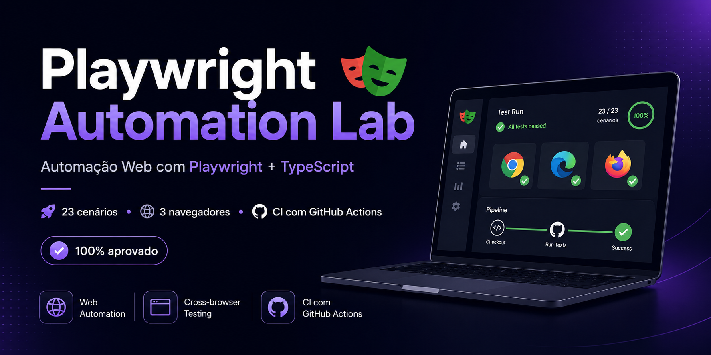

<p align="center">
  
</p>

<p align="center">
  <a href="https://github.com/RoxaneNayara/playwright-automation-lab/actions/workflows/playwright.yml">
    
  </a>
</p>

## Sobre o projeto

[](https://github.com/RoxaneNayara/playwright-automation-lab/actions/workflows/playwright.yml)

Laboratório de automação de testes desenvolvido com **Playwright** e **TypeScript**, criado para estudos, experimentação e demonstração de boas práticas em automação Web.

O projeto reúne testes funcionais, cenários end-to-end, validações de regras de negócio, acessibilidade automatizada, execução cross-browser, relatórios e integração contínua com GitHub Actions.

## Status do projeto

- 23 cenários automatizados
- 69 execuções cross-browser
- Chromium, Firefox e WebKit
- 100% dos testes aprovados
- ESLint, Prettier e TypeScript configurados
- Relatórios Playwright e Allure
- Pipeline automatizada no GitHub Actions

## Aplicações utilizadas

### TodoMVC

Aplicação utilizada para praticar operações básicas de uma lista de tarefas.

Cenários cobertos:

- adicionar uma tarefa;
- concluir uma tarefa;
- excluir uma tarefa;
- validar atualização da lista e do contador.

### SauceDemo

Aplicação de demonstração de e-commerce utilizada para automatizar jornadas mais completas.

Cenários cobertos:

- login com credenciais válidas;
- login com credenciais inválidas;
- usuário bloqueado;
- adição de produtos ao carrinho;
- remoção de produtos;
- remoção do último produto;
- persistência do carrinho durante a navegação;
- ordenação por menor preço;
- ordenação por maior preço;
- campos obrigatórios do checkout;
- cancelamento do checkout;
- cancelamento na revisão do pedido;
- cálculo do subtotal;
- cálculo do total com imposto;
- finalização da compra;
- limpeza do carrinho após a compra;
- retorno ao catálogo;
- análise automatizada de acessibilidade.

## Tecnologias e ferramentas

- Node.js
- TypeScript
- Playwright
- Playwright Test
- Axe Core
- Allure Report
- ESLint
- Prettier
- Git
- GitHub
- GitHub Actions

## Arquitetura do projeto

O projeto utiliza separação de responsabilidades entre testes, páginas, fluxos, configurações e dados.

```text
playwright-automation-lab
├── .github
│   └── workflows
│       └── playwright.yml
├── config
│   └── appsettings.json
├── src
│   ├── core
│   │   └── config
│   │       └── configurationManager.ts
│   └── web
│       ├── flows
│       │   └── sauceDemo
│       ├── pages
│       │   ├── sauceDemo
│       │   └── todo
│       └── support
│           └── sauceDemo
├── tests
│   └── web
│       ├── sauceDemo
│       │   ├── accessibility
│       │   ├── carrinho
│       │   ├── catalogo
│       │   ├── checkout
│       │   └── login
│       └── todo
├── eslint.config.js
├── package.json
├── playwright.config.ts
└── tsconfig.json
```

## Padrões utilizados

### Page Object Model

Os elementos e comportamentos das páginas ficam centralizados em classes de página.

Exemplos:

```text
SauceLoginPage
SauceInventoryPage
SauceCartPage
SauceCheckoutInformationPage
SauceCheckoutOverviewPage
SauceCheckoutCompletePage
TodoPage
```

Essa abordagem reduz duplicação, melhora a manutenção e mantém os testes focados na regra que está sendo validada.

### Flows

Fluxos reutilizáveis agrupam sequências de ações realizadas em diferentes testes.

Exemplo:

```text
SauceLoginFlow
```

O fluxo de login centraliza a navegação e o preenchimento das credenciais sem esconder as validações realizadas pelos testes.

### Dados de teste

Credenciais, produtos e informações do checkout ficam organizados em:

```text
src/web/support/sauceDemo/sauceTestData.ts
```

Essa separação evita repetição de valores e facilita a manutenção dos cenários.

## Instalação

Clone o repositório:

```bash
git clone https://github.com/RoxaneNayara/playwright-automation-lab.git
```

Acesse a pasta:

```bash
cd playwright-automation-lab
```

Instale as dependências:

```bash
npm ci
```

Instale os navegadores do Playwright:

```bash
npx playwright install
```

Em ambientes Linux ou de integração contínua:

```bash
npx playwright install --with-deps
```

## Execução dos testes

### Suíte completa cross-browser

```bash
npm run test:cross-browser
```

Executa os 23 cenários em Chromium, Firefox e WebKit, totalizando 69 execuções.

### Apenas Chromium

```bash
npm run test:chromium
```

### Apenas Firefox

```bash
npm run test:firefox
```

### Apenas WebKit

```bash
npm run test:webkit
```

### Apenas TodoMVC

```bash
npm run test:todo
```

### Apenas SauceDemo

```bash
npm run test:saucedemo
```

### Testes smoke

```bash
npm run test:smoke
```

### Execução com navegador visível

```bash
npm run test:headed
```

## Controles de qualidade

### Verificação do TypeScript

```bash
npm run typecheck
```

Valida tipagem, imports, aliases, propriedades e regras configuradas no `tsconfig.json`.

### ESLint

```bash
npm run lint
```

Verifica padrões de qualidade e possíveis inconsistências no código.

### Prettier

Verificar formatação:

```bash
npm run format:check
```

Aplicar formatação:

```bash
npm run format
```

## Relatórios

### Relatório HTML do Playwright

Após executar os testes:

```bash
npx playwright show-report
```

### Allure Report

Gerar o relatório:

```bash
npm run report:generate
```

Abrir o relatório:

```bash
npm run report:open
```

Executar o servidor temporário do Allure:

```bash
npm run report:serve
```

## Acessibilidade

A suíte utiliza `@axe-core/playwright` para identificar automaticamente violações de acessibilidade.

A tela de login é validada contra violações automáticas WCAG de níveis A e AA.

No catálogo, o projeto mantém uma baseline explícita para uma violação conhecida:

```text
select-name
```

A baseline permite:

- registrar o débito de acessibilidade conhecido;
- impedir o surgimento silencioso de novas violações;
- detectar quando a violação existente for corrigida;
- manter a análise automatizada transparente.

A automação de acessibilidade complementa, mas não substitui, testes manuais com teclado, leitores de tela e avaliação humana.

## GitHub Actions

O workflow está localizado em:

```text
.github/workflows/playwright.yml
```

A pipeline é executada em `push`, `pull_request` e também pode ser iniciada manualmente.

Etapas executadas:

```text
Checkout do repositório
→ configuração do Node.js
→ instalação das dependências
→ instalação dos navegadores
→ verificação do Prettier
→ verificação do TypeScript
→ execução do ESLint
→ testes cross-browser
→ upload do relatório Playwright
→ upload dos resultados Allure
```

Os relatórios são disponibilizados como artefatos da execução no GitHub Actions.

## Tags

Os testes utilizam tags para facilitar a seleção de cenários:

```text
@web
@todo
@sauceDemo
@smoke
@regression
@negative
@e2e
@login
@carrinho
@catalogo
@checkout
@financial
@accessibility
```

Exemplo de execução por tag:

```bash
npx playwright test --grep "@checkout"
```

No PowerShell, as aspas evitam que o caractere `@` seja interpretado pelo terminal.

## Classificação do projeto

Este repositório representa um **laboratório de estudos e prova de conceito**, com práticas estruturadas para demonstrar automação de testes.

Os padrões implementados podem servir como referência, mas devem ser avaliados e adaptados antes de uso em sistemas corporativos, considerando arquitetura, segurança, dados, ambientes, criticidade e estratégia de testes de cada produto.

## Próximas evoluções

- testes de API com Playwright;
- validação de contratos;
- integração entre API e interface;
- geração de dados por API;
- autenticação reutilizável;
- regressão visual;
- publicação navegável do Allure;
- evolução da documentação;
- expansão da pipeline de integração contínua.

## Autora

**Roxane Nayara**

Coordenadora de QA, com atuação em processos de qualidade, estratégia de testes, desenvolvimento de pessoas e evolução da automação.

GitHub: [RoxaneNayara](https://github.com/RoxaneNayara)
