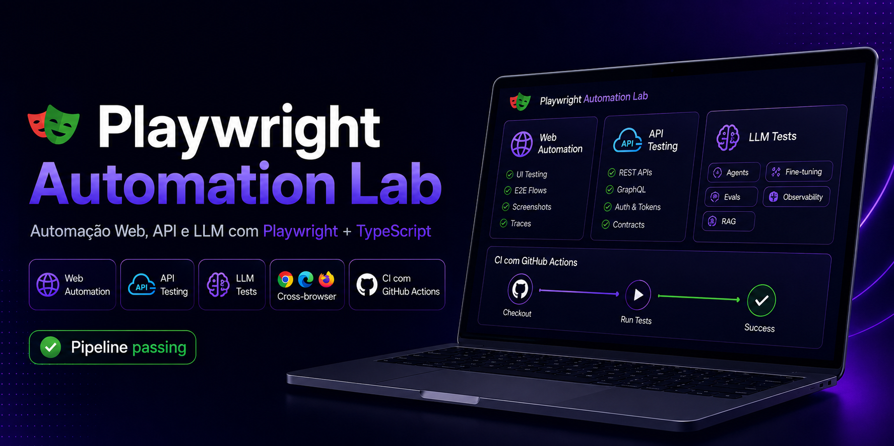

<p align="center">
  
</p>

<p align="center">
  <a href="https://github.com/RoxaneNayara/playwright-automation-lab/actions/workflows/playwright.yml">
    
  </a>
</p>

## Sobre o projeto

Laboratório de automação de testes desenvolvido com **Playwright** e **TypeScript**, criado para estudos, experimentação e demonstração de boas práticas em qualidade de software.

O projeto reúne automação Web, testes de API e uma trilha dedicada à qualidade de sistemas baseados em **LLMs**, incluindo testes funcionais, cenários end-to-end, validações de regras de negócio, robustez, acessibilidade, RAG, embeddings, evals, prompt injection, tool calling, regressão, observabilidade, controle de custo e integração contínua.

O objetivo não é apenas validar respostas, mas estudar como diferentes características de qualidade podem ser testadas de forma automatizada e reproduzível.

## Status do projeto

### Web

- 23 cenários automatizados;
- 69 execuções cross-browser;
- Chromium, Firefox e WebKit;
- TodoMVC e SauceDemo;
- acessibilidade automatizada com Axe Core.

### API

- 16 cenários automatizados;
- operações CRUD;
- busca e paginação;
- cenários negativos;
- testes de robustez;
- validação de comportamento de API pública.

### LLM

A trilha de testes de LLM cobre:

- fundamentos de interação com modelos;
- structured output;
- instruction following;
- validação de respostas;
- prompt injection;
- groundedness;
- embeddings e similaridade semântica;
- semantic ranking e Top-K retrieval;
- RAG manual e com múltiplas fontes;
- thresholds e safe fallback;
- métricas de retrieval;
- RAG evals;
- answer correctness;
- answer relevance;
- faithfulness;
- context relevance;
- regression testing;
- model comparison;
- quality guards;
- observabilidade;
- tokens, latência e custo;
- budget guards;
- Agents e Tool Calling;
- segurança contra Tool Injection;
- preparação e avaliação de Fine-tuning.

### Engenharia e CI

- ESLint;
- Prettier;
- TypeScript;
- Playwright HTML Report;
- Allure Report;
- GitHub Actions;
- quality gates para testes de LLM;
- execução automatizada da suíte cross-browser.

## Aplicações e serviços utilizados

### TodoMVC

Aplicação utilizada para praticar operações básicas de uma lista de tarefas, com cenários de criação, conclusão, exclusão e atualização da lista.

### SauceDemo

Aplicação de demonstração de e-commerce utilizada para automatizar jornadas de login, catálogo, carrinho, checkout, regras financeiras e acessibilidade.

### DummyJSON API

API pública utilizada para estudos de automação de testes de API com Playwright.

A suíte cobre operações CRUD, busca, paginação, cenários negativos e testes de robustez envolvendo campos ausentes, valores vazios ou nulos, tipos incorretos, preços negativos, textos extensos, caracteres especiais e Content-Type incompatível.

As operações de escrita da DummyJSON são simuladas e não persistem os dados. Por isso, os testes validam status HTTP, estrutura da resposta, dados retornados e comportamento observado, sem afirmar persistência real.

### OpenAI API

Utilizada na trilha experimental de testes de sistemas com LLM.

Os cenários exploram geração de respostas, embeddings, RAG, evals, tool calling, model comparison, regressão, observabilidade e preparação para fine-tuning.

Os testes que dependem da API utilizam chave configurada por variável de ambiente e secret no GitHub Actions. Nenhuma chave é armazenada no repositório.

## Tecnologias e ferramentas

- Node.js
- TypeScript
- Playwright
- Playwright Test
- OpenAI SDK
- OpenAI API
- Axe Core
- Allure Report
- ESLint
- Prettier
- Git
- GitHub Actions

## Arquitetura do projeto

O projeto separa as trilhas de Web, API e LLM para preservar responsabilidade, organização e evolução independente.

```text
playwright-automation-lab
├── .github
│   └── workflows
│       └── playwright.yml
├── config
├── docs
├── src
│   ├── core
│   └── web
│       ├── flows
│       ├── pages
│       └── support
├── tests
│   ├── api
│   │   └── dummyJson
│   │       └── products
│   │           ├── atualizar
│   │           ├── buscar
│   │           ├── criar
│   │           │   └── robustez
│   │           ├── excluir
│   │           └── listar
│   ├── llm
│   │   ├── agents
│   │   ├── embeddings
│   │   ├── evals
│   │   ├── fine-tuning
│   │   ├── fundamentals
│   │   ├── groundedness
│   │   ├── instructionFollowing
│   │   ├── observability
│   │   ├── promptInjection
│   │   ├── rag
│   │   │   └── evals
│   │   ├── regression
│   │   ├── structuredOutput
│   │   └── validation
│   └── web
│       ├── sauceDemo
│       └── todo
├── eslint.config.js
├── package.json
├── playwright.config.ts
├── README.md
└── tsconfig.json
```

## Automação Web

### Page Object Model

Os elementos e comportamentos das páginas ficam centralizados em classes de página, reduzindo duplicação e mantendo os testes focados nas regras validadas.

### Flows

Fluxos reutilizáveis agrupam sequências de ações realizadas em diferentes testes, sem esconder as validações.

### Dados de teste

Credenciais, produtos e informações de checkout ficam separados dos testes para facilitar manutenção e reutilização.

## Testes de API

A trilha de API utiliza Playwright Request para validar comportamento de endpoints públicos.

Os cenários incluem:

- operações CRUD;
- busca;
- paginação;
- dados inválidos;
- campos ausentes;
- valores nulos;
- tipos incorretos;
- limites e entradas extensas;
- caracteres especiais;
- Content-Type incompatível;
- comportamento observado de uma API que simula operações de escrita.

## Testes de sistemas com LLM

A trilha LLM foi construída progressivamente, partindo de chamadas básicas até cenários de avaliação, segurança e governança.

### Embeddings e Retrieval

Os testes exploram:

- geração de embeddings;
- similaridade semântica;
- cosine similarity;
- semantic ranking;
- Top-K retrieval.

### RAG

Os cenários de Retrieval-Augmented Generation validam:

- recuperação manual de contexto;
- múltiplas fontes;
- source attribution;
- thresholds de relevância;
- ausência de contexto suficiente;
- safe fallback;
- respostas fundamentadas no contexto recuperado.

### Métricas de Retrieval

O laboratório implementa métricas para avaliar a qualidade da recuperação:

- Precision@K;
- Recall@K;
- F1 Score;
- Mean Reciprocal Rank — MRR;
- nDCG.

Também há avaliação agregada sobre datasets com múltiplas perguntas.

Os thresholds utilizados são **critérios experimentais do laboratório** e não representam padrões universais de produção.

### RAG Evals

A qualidade da geração é avaliada por diferentes dimensões:

- Answer Correctness;
- Answer Relevance;
- Faithfulness;
- Context Relevance.

Também há avaliação agregada de múltiplos casos.

### Groundedness

Os testes verificam situações como:

- resposta totalmente sustentada;
- ausência de informação;
- contexto relacionado, porém insuficiente;
- contexto contraditório;
- respostas parcialmente sustentadas;
- atribuição correta e incorreta de fontes.

### Prompt Injection

A suíte inclui cenários de:

- prompt injection direto;
- indirect prompt injection;
- instruções maliciosas disfarçadas;
- conteúdo legítimo misturado com instruções adversariais;
- ataques fragmentados.

### Regression e Model Comparison

Os testes avaliam:

- comparação entre modelos;
- qualidade média em datasets;
- latência;
- consumo de tokens;
- quality guards;
- regressão individual;
- regressão agregada.

O objetivo é detectar deterioração de comportamento antes que uma alteração de modelo ou configuração seja aceita.

### Observability

A trilha mede:

- input tokens;
- output tokens;
- total de tokens;
- latência;
- custo estimado por chamada;
- custo agregado da suíte;
- budget guard;
- latency guard.

Os valores de custo utilizados nos testes são parâmetros experimentais e devem ser atualizados conforme o modelo e a política de preços utilizados.

### Agents e Tool Calling

Os testes de Agents validam:

- seleção da ferramenta correta;
- argumentos enviados para a ferramenta;
- situações em que nenhuma ferramenta é necessária;
- ausência de parâmetros obrigatórios;
- tratamento de erro da ferramenta;
- grounding no retorno da ferramenta;
- resistência a Tool Injection;
- detecção de instruções maliciosas em retornos de ferramentas.

Os cenários utilizam ferramentas simuladas para testar decisões e comportamento do agente sem executar operações bancárias ou serviços reais.

### Fine-tuning

A trilha de Fine-tuning cobre:

- estrutura de datasets;
- validação de exemplos de treinamento;
- JSONL;
- criação e leitura de arquivo temporário;
- duplicidade;
- cobertura de categorias;
- distribuição mínima;
- baseline evaluation;
- challenging baseline;
- decision gate;
- thresholds de decisão;
- upload real de dataset com `purpose: fine-tune`.

Nos experimentos realizados, o modelo base atingiu **100% de acurácia** tanto no baseline simples quanto no conjunto desafiador controlado.

Por isso, os próprios evals não apresentaram evidência de necessidade de Fine-tuning para essa tarefa específica.

Também foi realizada uma tentativa real de criação de um job de Fine-tuning. O arquivo de treinamento foi aceito e processado pela plataforma, porém a criação do job retornou `HTTP 403`, informando que a organização utilizada no laboratório não está habilitada para criar novos jobs.

O código correspondente foi preservado como exemplo manual em:

```text
tests/llm/fine-tuning/examples/createFineTuningJob.example.ts
```

Ele não faz parte da suíte automática.

> Os resultados de Fine-tuning apresentados neste projeto foram obtidos em cenários controlados de estudo. Em sistemas reais, datasets, comportamento dos modelos, custo, latência e métricas podem variar.

## Instalação

```bash
git clone https://github.com/RoxaneNayara/playwright-automation-lab.git
cd playwright-automation-lab
npm ci
npx playwright install
```

Em ambientes Linux ou de integração contínua:

```bash
npx playwright install --with-deps
```

## Configuração para testes LLM

Os testes que utilizam a OpenAI API dependem da variável:

```text
OPENAI_API_KEY
```

Ela deve ser configurada no ambiente local e nunca adicionada diretamente ao código ou ao repositório.

No GitHub Actions, a chave é configurada como Repository Secret.

## Execução dos testes

### Suíte Web cross-browser

```bash
npm run test:cross-browser
```

### API DummyJSON

```bash
npx playwright test tests/api/dummyJson --project=api-dummyjson
```

### LLM

```bash
npx playwright test tests/llm --project=llm
```

### RAG

```bash
npx playwright test tests/llm/rag --project=llm
```

### Agents

```bash
npx playwright test tests/llm/agents --project=llm
```

### Fine-tuning

```bash
npx playwright test tests/llm/fine-tuning --project=llm
```

### Execuções Web específicas

```bash
npm run test:chromium
npm run test:firefox
npm run test:webkit
npm run test:todo
npm run test:saucedemo
npm run test:smoke
npm run test:headed
```

## Controles de qualidade

```bash
npm run format
npm run format:check
npm run typecheck
npm run lint
```

Rotina recomendada antes de cada commit:

```bash
npm run format
npm run format:check
npm run typecheck
npm run lint
```

Após alterações funcionais, recomenda-se executar também a suíte correspondente à área modificada.

## Relatórios

### Playwright HTML

```bash
npx playwright show-report
```

### Allure

```bash
npm run report:generate
npm run report:open
npm run report:serve
```

## Acessibilidade

A suíte Web utiliza `@axe-core/playwright` para identificar violações automatizadas de acessibilidade.

A automação complementa, mas não substitui, testes manuais com teclado, leitores de tela e avaliação humana.

## GitHub Actions

O workflow está localizado em:

```text
.github/workflows/playwright.yml
```

A pipeline executa:

```text
Checkout
→ instalação das dependências
→ instalação dos navegadores
→ Prettier
→ TypeScript
→ ESLint
→ LLM CI quality gates
→ testes Web cross-browser
→ upload dos relatórios Playwright
→ upload dos resultados Allure
```

Os testes LLM adicionados ao CI são selecionados como **quality gates**, evitando executar indiscriminadamente cenários de maior custo ou operações externas que não devem fazer parte de cada pipeline.

A variável `OPENAI_API_KEY` é fornecida ao workflow por meio de GitHub Actions Secrets.

## Tags

Os testes utilizam tags por tipo, aplicação, recurso, operação e característica de qualidade.

Exemplos:

```text
@web
@api
@todo
@sauceDemo
@dummyJson
@products
@smoke
@negative
@robustness
@functionalSuitability
@reliability
@compatibility
@security
```

Execução por tag:

```bash
npx playwright test --grep "@checkout"
```

## Classificação do projeto

Este repositório representa um **laboratório de estudos e prova de conceito**.

Os padrões implementados podem servir como referência, mas devem ser avaliados e adaptados antes do uso em sistemas corporativos, considerando arquitetura, segurança, dados, ambientes, criticidade, custo e estratégia de testes.

Os thresholds, datasets e critérios de aprovação utilizados nos testes de LLM são experimentais e foram definidos para fins de estudo.

Resultados obtidos em cenários controlados não devem ser interpretados como garantia de comportamento equivalente em produção.

## Release atual

A release publicada **v1.0.0 — Automação Web** reúne 23 cenários automatizados e 69 execuções cross-browser.

[Ver detalhes da release v1.0.0](https://github.com/RoxaneNayara/playwright-automation-lab/releases/tag/v1.0.0)

Desde essa release, o laboratório também evoluiu com trilhas de **API e testes de sistemas com LLM**, ainda não consolidadas em uma nova release versionada.

## Próximas evoluções

- criação de clients e models reutilizáveis para API;
- validação de contratos com JSON Schema;
- autenticação reutilizável;
- testes seguros de segurança de API;
- integração entre API e interface;
- geração de dados por API;
- regressão visual;
- publicação navegável do Allure;
- ampliação dos datasets de avaliação LLM;
- evolução dos quality gates de LLM;
- externalização e reutilização de datasets;
- evolução da documentação.

## Autora

**Roxane Nayara**

QA Lead | Coordenadora de QA, com atuação em estratégia de testes, liderança de qualidade, desenvolvimento de pessoas, automação, governança e melhoria contínua.

GitHub: [RoxaneNayara](https://github.com/RoxaneNayara)
